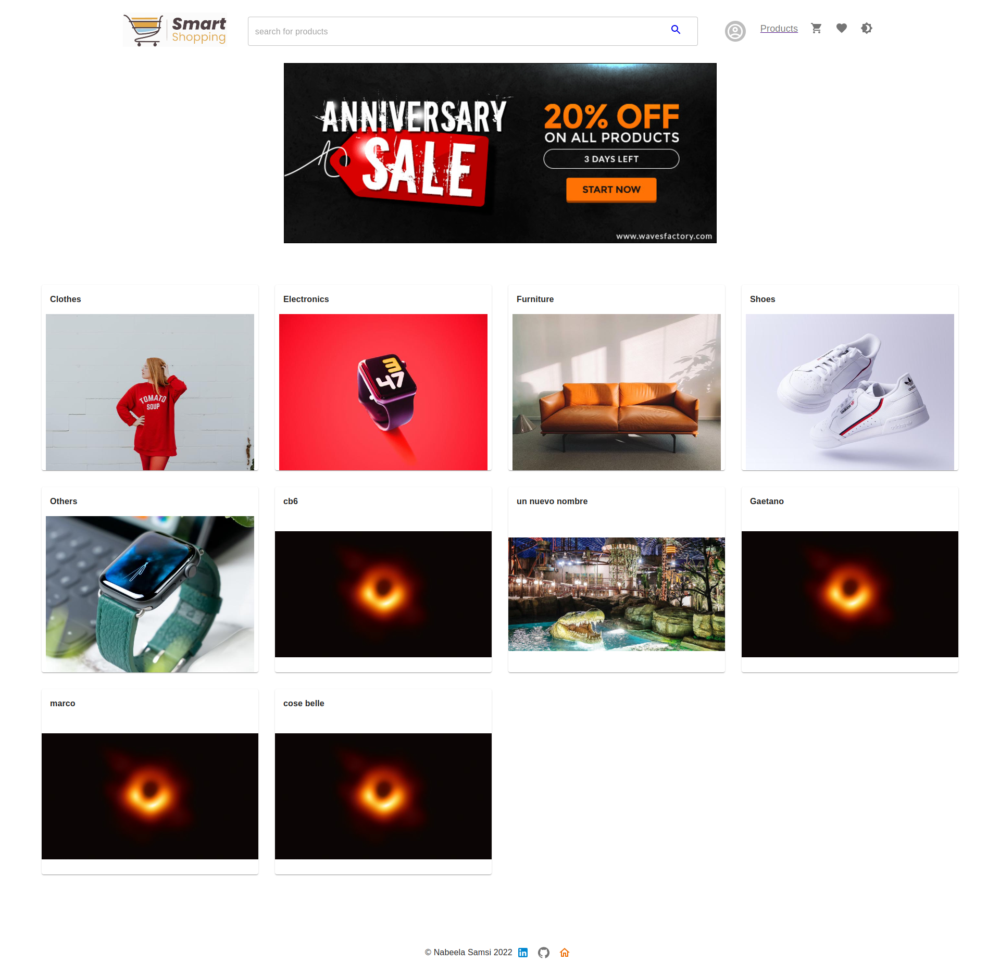
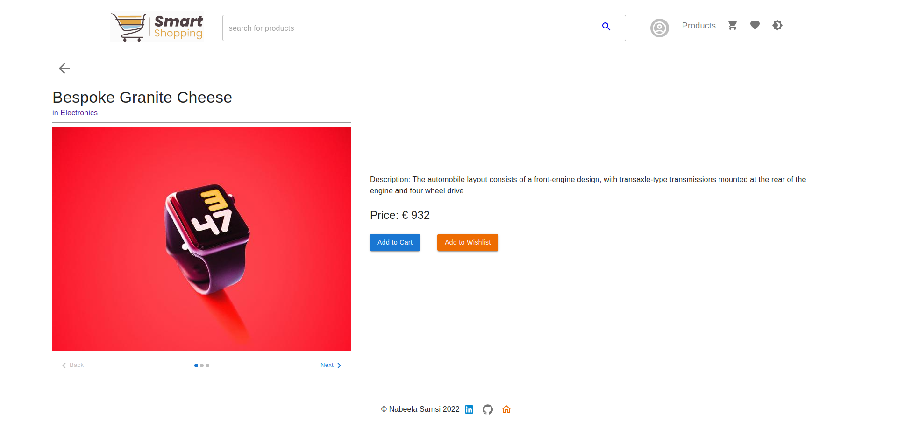
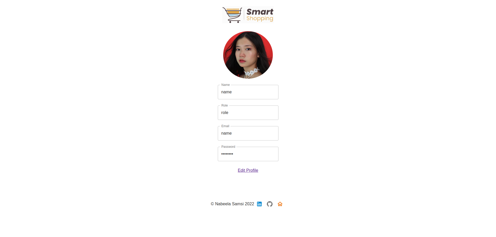
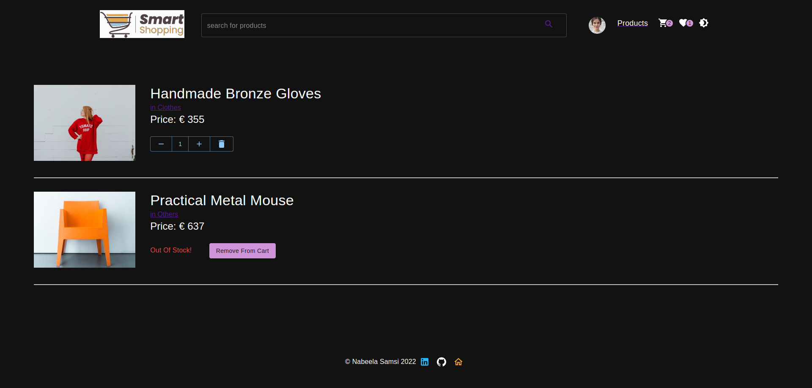

# Front-end Project

Welcome to the Smart Shopping website :)

# Demo

[Smart Shopping](https://effulgent-malabi-6f7652.netlify.app/)

# Tech Stack

    - React
    - Redux
    - Typescript
    - MaterialUI
    - SASS
    - HTML

## How the data is managed?

    - Using [Platzi Fake Store API](https://fakeapi.platzi.com/), we are able to fetch, authenticate, create, update and delete the data.
    - The create, update and delete actions is reflecting in the api.

## How the sites work and what are the features expected

    - Clicking on logo redirects to home page
    - User will be able to change the darkMode accordingly
    - On hoveing the profile icon at the header, if not loggedin user see login/signup and my profile
    - in sign up and login form proper validation is done and respective error message displayed to help user understand what they are doing wrong
    - New user will be able to create a new account
    - If customer is logged in on hovering profile will able to see my profile and logout
    - If admin logged in on hovering he will see my profile, add product, add category and logout. - Only admin have access to add/delete/update the product and category
    - Loggedin user when clicks on my profile will be redirected to User profile page, where he can view and if he wants to make changes he can click on edit link
    - In Home list of clickable categories displayed, when a specific category is clicked it will take you to the list of product belongs to that category.
    - Search box displayed in header, helps in finding the specific product.
    - In Products pagination is applied
    - In Products page displaying the list of clickable products on clicked take you to product detail page.
    - In Products page there is a sorting dropdown, which is used in sorting data with respect to price and product name.
    - In single product page if user is logged in can add product either in cart or wishlist or he will be redirected to login page
    - User can navigate to cart or wishlist by clicking the icon present in header.
    - If user is logged in then only can get navigated to the cart or wishlist page else he will be redirected to login page.
    - If user logged in and goes to cart page then he can increment or dercrement the product quantity. If quantity is 0 it will get removed from cart
    - If user logged in and goes to wishlist page then he will be able to add the product on cart or remove from wishlist
    - The cart and wishlist data of respective users are stored so that whenever they come back they will be able to view and modify it.

## Features planning to implement

    - Currently all user, product and category form has url field to add image, Planning to display both url and file input button.
    - Checkout page
    - Forgot password page
    - User Address page
    - Billing page
    - Persisting the dark mode with respect to userId
    - Orders page

## Below are few screenshots of Smart Shopping

Home

Products

Product

User Profile

Cart

WishList

## Steps to install and run the project

In the project directory, you can run:

### `npm install`

Install all the required dependencies

### `npm start`

Runs the app in the development mode.\
Open [http://localhost:3000](http://localhost:3000) to view it in the browser.

The page will reload if you make edits.\

### `npm test`

Launches the test runner in the interactive watch mode

### `npm run build`

Builds the app for production to the `build` folder.\
It correctly bundles React in production mode and optimizes the build for the best performance.
